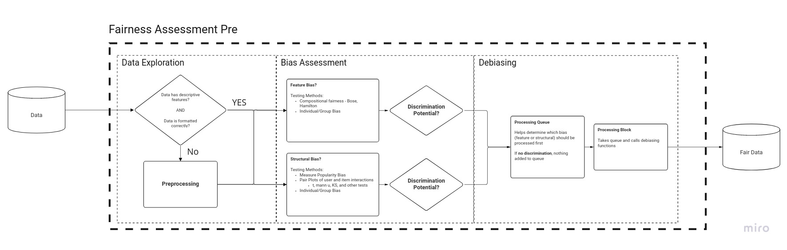

# PrEFair-Fairness

Hello, dean here. (September 2022)

Currently, the prefair-fairness pipeline is not complete. I wish whom ever is finishing the pipeline all the best. 

From July-September I was working on the **Bias Assessment** part of the pipeline mentioned in the graphic above. Most of the most recent weeks have been devoted to identifying **feature bias** that is apart in many recommendation datasets. **Feature bias** occurs in a correlated fashion to **unbalanced data.** Much if not all of the code worked on during these past weeks were focused on creating machine learning to identify how vulnerable users information is when given a dataset with unbalanced attributes (indicating possible feature bias).

In addition to this, there were many attempts to implement an algorithm that would be able to collect the severity of feature bias by implementing functions to preform statistical analysis on a given dataset. Specifically, the **KS-Test** and the **Wasserstein Metric** proved to be the most applicable combination of metrics to analyze the severity of how unbalanced/biased the given dataset was.

### **Repository Outline**
Within this repository I have done my best to minimize the clutter that occurs when developing by consolidating most of the physical code into a few folders. Most notably, the **src** folder
is going to be of most use to those who want to utilize my predefined functions. I have documented much of the code so please try and read the notes when you find something confusing. Additionally as a note on confusion, my email after this current internship is charles.dean.cochran at outlook.com if you want to ask a question or would like me to clarify anything. I will be more than happy to connect with you. 

Inside the **old_notebooks** folder is a collection of examples I used while maintaining the src folder. It allowed myself to see the bigger picture and provide as much detail as I could while I was defining useful functions for the **Bias Assessment.** I recommend adjusting the root location of where each notebook is ran, as I have changed many file names and directories to consolidate the code into this format, hence the name 'old_notebooks.'

The **test** folder is simply under developed. I just placed this file there to encourage others to test their code. As well as provide a few examples of how you can implement some unit tests for functions that you make/use in the src folder. 

### **Requirements.txt**
The PrEFair project does not have a centralized location to store its necessary dependencies yet. This file is not a replacement for what ever will be used, but rather it is a collection of utilities I used for this repo. 

Please run the installation for these files inside of a python3.8 or greater environment via.

    python3 -m venv .env

cd into the .env folder, and type

    source bin/activate

cd out of the .env folder and cd into the prefair-fairness repository to install the requirements

    pip3 install -r requirements.txt

**Note:** Pytorch Geometric, the graph network library used for much of the provided code is os dependent. Please visit there documentation and install the necessary version for your device

    pip3 install torch-scatter torch-sparse torch-cluster torch-spline-conv torch-geometric -f https://data.pyg.org/whl/{TORCH_VERSION}+{CUDA_VERSION}.html

**If you don't know your torch or cuda version you can open up python and run the following to check**

    import torch
    print(torch.__version__)
